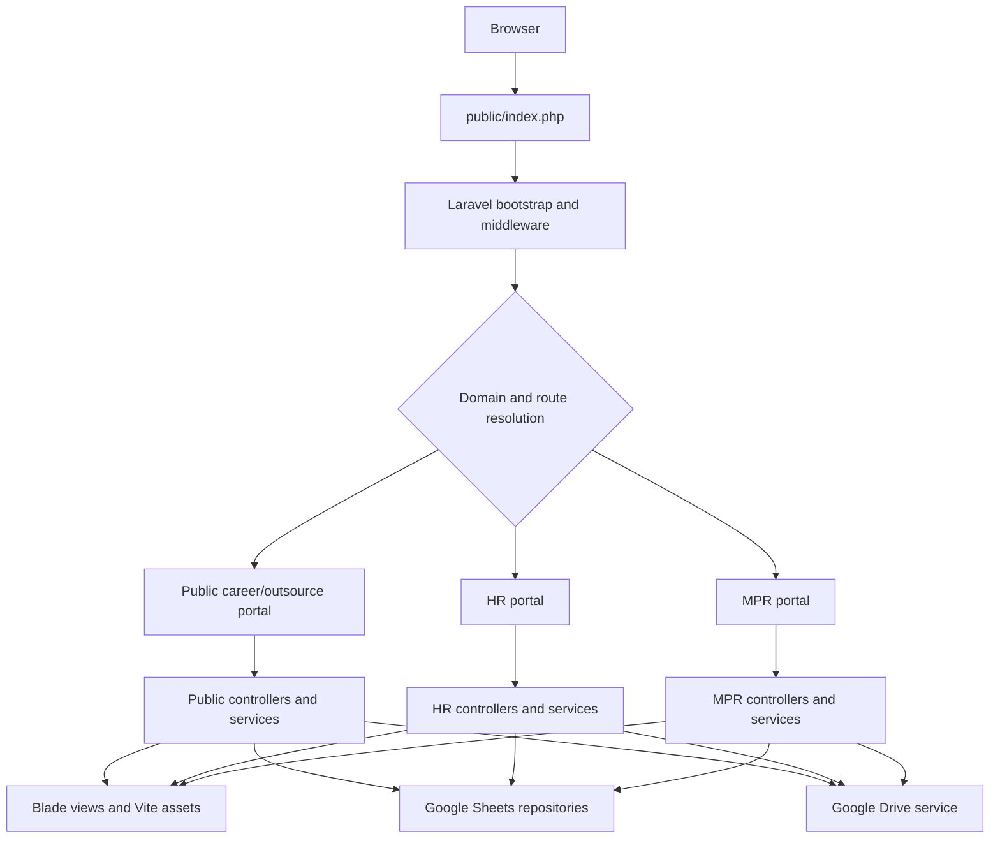
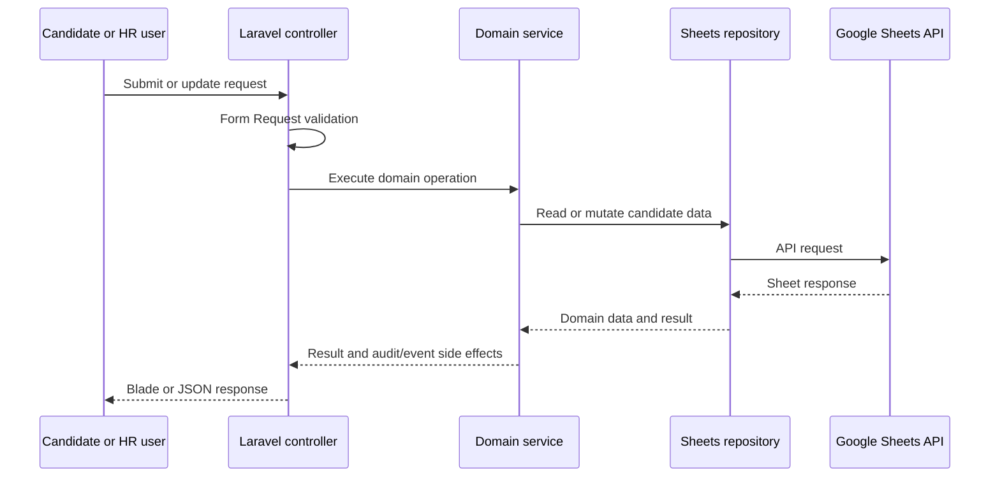

# MITO HRIS - System Architecture

**Project:** MITO HRIS
**Application:** Laravel 12 modular monolith
**Repository:** `google-script-hr` (shared historical Git repository)
**Active application:** `mito-hris-laravel/`
**Last Updated:** 2026-09-05

## 1. Scope

Laravel is the active runtime application. The former Google Apps Script source and its local deployment configuration have been removed from the working tree.

Google Sheets and Google Drive remain data and document services accessed through Google APIs from Laravel. They are not Apps Script dependencies.

The repository intentionally remains one Git repository. Git history, remotes, branches, and deployment history are preserved.

## 2. Repository Structure

```text
google-script-hr/
├── .github/workflows/
│   ├── ci.yml                    # Laravel syntax, build, and test workflow
│   └── deploy.yml                # SSH deployment workflow
├── mito-hris-laravel/
│   ├── app/
│   │   ├── Console/Commands/     # Diagnostics, setup, sync, and seed commands
│   │   ├── DTOs/                 # Typed application data objects
│   │   ├── Enums/                # Domain status and decision values
│   │   ├── Events/Listeners/     # Domain events and side effects
│   │   ├── Http/                 # Controllers, middleware, and requests
│   │   ├── Models/               # Local Laravel models
│   │   ├── Repositories/         # Sheets-backed repository implementations
│   │   ├── Rules/                # Reusable validation rules
│   │   ├── Services/             # Domain, Google API, PDF, and utility services
│   │   └── Support/              # Shared authorization support
│   ├── bootstrap/                # Laravel bootstrap and providers
│   ├── config/                   # Framework, domain, Google, and SEO settings
│   ├── database/data/            # Laravel-local region data
│   ├── public/                   # Web entrypoint, assets, data, and build output
│   ├── resources/                # Blade views, JavaScript, and SCSS
│   ├── routes/                   # Web, API, and console routes
│   ├── storage/                  # Runtime cache, logs, uploads, and credentials
│   ├── tests/                    # Feature and unit tests
│   ├── composer.json             # PHP dependencies and scripts
│   ├── package.json              # Vite/frontend dependencies and scripts
│   └── vite.config.js            # Laravel Vite configuration
├── data/, images/, templates/    # Root reference artifacts; review separately
├── docs/                         # Root documentation and historical material
└── AGENTS.md                     # Repository agent/development rules
```

Root reference artifacts are not loaded by Laravel merely because they share names with application files. Laravel uses its own `database/data/`, `public/data/`, `public/assets/`, and `resources/` paths.

## 3. Runtime Request Flow



`bootstrap/app.php` registers the Laravel application and route files. Requests enter through `public/index.php`, pass middleware, reach a controller, and use services or repositories for business operations.

## 4. Portal and Authentication Boundaries

| Portal        | Main purpose                                           | Boundary                                                     |
| ------------- | ------------------------------------------------------ | ------------------------------------------------------------ |
| Public career | Candidate application and status/self-update           | Public controllers and portal middleware                     |
| HR            | Recruitment, employees, probation, settings, and users | HR authentication, roles, permissions, and domain middleware |
| MPR           | Manpower requestor workflow                            | MPR authentication and requestor middleware                  |

HR and MPR authentication contexts are isolated even when an email or username exists in both Google Sheets stores. Authorization is enforced by middleware, Laravel Gate/RBAC support, request validation, and controller checks. UI visibility is not the security boundary.

## 5. Application Layers

### HTTP Layer

- `routes/web.php` defines local and production-domain web routes.
- `routes/api.php` defines JSON endpoints such as region lookup and NIK parsing.
- Controllers coordinate requests and responses.
- Form Request classes validate input at the boundary.
- Middleware enforces domain isolation, authentication, role access, and security headers.

### Domain Layer

- Recruitment manages candidate applications, status transitions, notes, and candidate documents.
- Employee manages records, imports, contracts, offboarding, and rotation.
- Probation manages evaluations and decisions.
- MPR manages manpower requests and requestor workflows.
- Master data manages configurable dropdown and reference values.
- Services contain orchestration; DTOs and enums keep contracts explicit.

### Persistence Layer

```text
Controllers
    -> Domain Services
        -> Repository contracts
            -> Sheets repositories / GoogleSheetsService
                -> Google Sheets API
```

Google Drive document operations use `GoogleDriveService`. Credentials and IDs come from environment-backed configuration in `config/google.php`; credentials must never be committed.

## 6. Google Sheets Data Boundary

Configured sheet tabs include:

- `data_kandidat`
- `kandidat_hold`
- `kandidat_blacklist`
- `kandidat_accepted`
- `kandidat_probation`
- `Employee`
- `Audit_Log`
- `Users`
- `MPR`
- `mpr_requestor`

Header schemas are defined under Laravel configuration and consumed by repositories and schema validation services. Existing sheet names, headers, column order, identifier formats, and `Asia/Jakarta` timestamps are compatibility contracts.

NIK, phone numbers, recruitment IDs, and employee IDs retain text semantics. Do not convert identifiers to numeric storage or silently change normalization rules.

## 7. Frontend Architecture

Blade views live under `resources/views/` and are organized into layouts, components, portal pages, HR pages, MPR pages, public pages, and PDF views.

Vite entrypoints declared in `vite.config.js` include:

- `resources/scss/app.scss`
- `resources/scss/public.scss`
- `resources/scss/hr.scss`
- `resources/js/app.js`
- `resources/js/page-loader.js`
- `resources/js/csp-hardening.js`
- `resources/js/utils/nik-autofill.js`

The application does not use the removed Apps Script HTML include model. Do not reintroduce `google.script.run`, `HtmlService`, or root GAS `views/`, `partials/`, `css/`, or `js/` modules.

## 8. Important Workflows

### Candidate and Recruitment



Status transitions, employee creation, probation decisions, and document generation preserve existing audit and authorization behavior.

### Documents

PDF services render Blade templates for offering letters, contracts, BPJS letters, performance reviews, paklaring, and other HR documents. Uploaded or generated files use the configured Google Drive integration where applicable.

## 9. CI/CD and Deployment

### Continuous Integration

`.github/workflows/ci.yml` runs from `mito-hris-laravel/` and:

1. Checks out the existing repository.
2. Sets up PHP 8.3 and Node.js 20.
3. Installs Composer and NPM dependencies.
4. Copies `.env.example` and generates an application key.
5. Validates PHP syntax.
6. Builds Vite assets.
7. Runs the Laravel test suite.

### Production Deployment

`.github/workflows/deploy.yml` deploys over SSH to `/home/ubuntu/hris/mito-hris-laravel`. It verifies the workflow commit, installs production dependencies, builds assets, prepares writable directories, runs Laravel diagnostics and Google Sheets checks, clears and caches Laravel, and reloads PHP-FPM.

There is no Apps Script or `clasp` deployment in the active CI/CD architecture.

## 10. Operational Invariants

- Keep this repository and its Git history intact.
- Keep `.github/workflows/` aligned with the Laravel deployment path.
- Preserve authentication, authorization, RBAC, domain isolation, and public URLs.
- Preserve Google Sheets and Google Drive API integration.
- Do not edit production data during local validation.
- Do not commit `.env`, service-account credentials, or generated secrets.
- Validate touched behavior with focused tests, then run broader Laravel checks when the change affects shared infrastructure.

## 11. Verification Commands

Run from `mito-hris-laravel/`:

```powershell
php artisan test --without-tty
php artisan view:cache
php artisan route:list
npm run build
```

Before release, inspect both workflow files and confirm their Git diff is clean.
