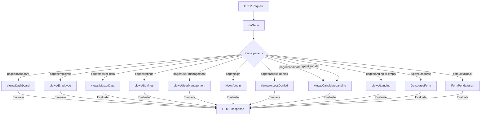
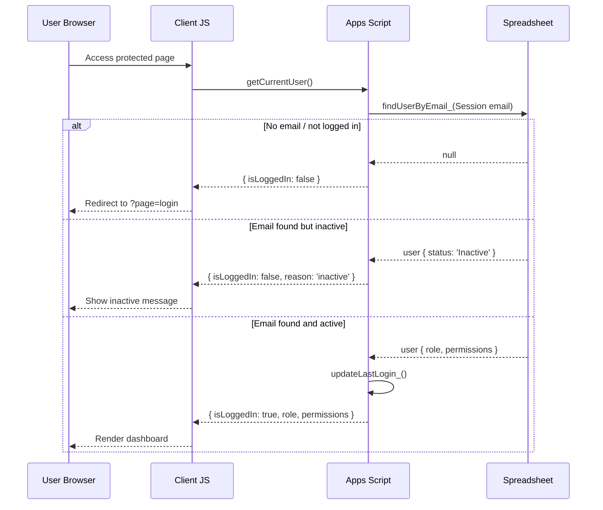
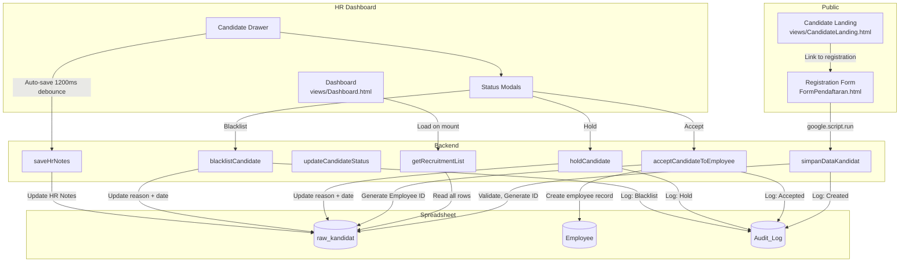
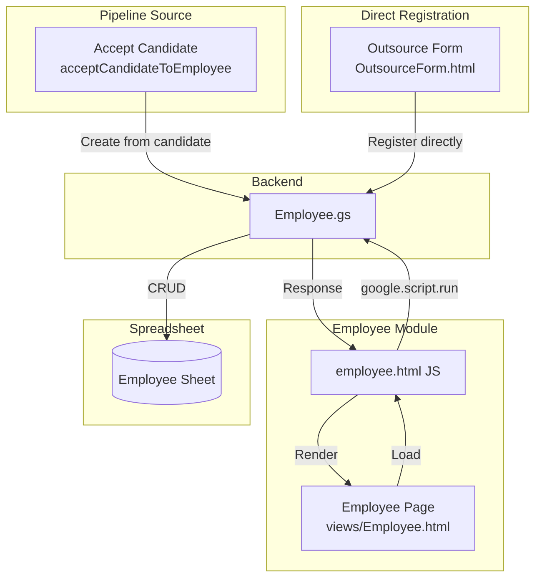
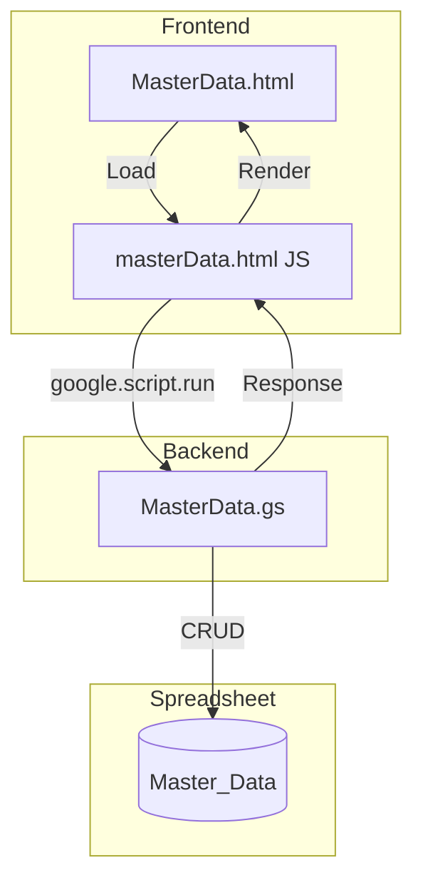
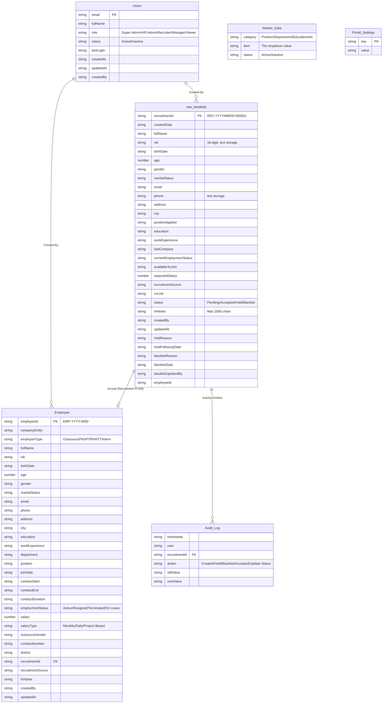
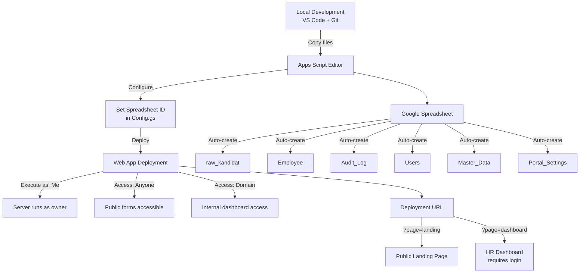

# ARCHITECTURE.md — System Architecture

**Project**: Mahakarya HRIS — Applicant Tracking System (ATS)  
**Platform**: Google Apps Script + Google Sheets  
**Version**: v0.6.0  
**Last Updated**: 2026-08-03

---

## Table of Contents

1. [Folder Structure](#1-folder-structure)
2. [Google Apps Script Architecture](#2-google-apps-script-architecture)
3. [Routing Flow](#3-routing-flow)
4. [Authentication Flow](#4-authentication-flow)
5. [Candidate Flow](#5-candidate-flow)
6. [Employee Flow](#6-employee-flow)
7. [Master Data Flow](#7-master-data-flow)
8. [Google Sheets Structure](#8-google-sheets-structure)
9. [Deployment Flow](#9-deployment-flow)
10. [Module Dependency Diagram](#10-module-dependency-diagram)

---

## 1. Folder Structure

```
e:/Project/HRIS/
│
├── Kode.gs                          # Entry point — doGet() router & include() helper
│
├── backend/                         # Server-side Google Apps Script modules
│   ├── Config.gs                    # Global constants (sheet names, headers)
│   ├── Auth.gs                      # Authentication & RBAC (Google SSO)
│   ├── Recruitment.gs               # Candidate CRUD operations
│   ├── Employee.gs                  # Employee management CRUD
│   ├── MasterData.gs                # Master data CRUD (dropdown sources)
│   ├── PortalSettings.gs            # Portal settings CRUD
│   ├── Import.gs                    # CSV/Excel import logic
│   ├── Outsource.gs                 # Outsource employee registration
│   └── GenerateDummyData.gs         # Test data generation
│
├── views/                           # Main HTML page templates
│   ├── Dashboard.html               # HR Dashboard (main internal page)
│   ├── Employee.html                # Employee management page
│   ├── MasterData.html              # Master data management page
│   ├── Settings.html                # Portal settings page
│   ├── UserManagement.html          # User management (Super Admin)
│   ├── Login.html                   # Login page
│   ├── AccessDenied.html            # Unauthorized access page
│   ├── Landing.html                 # Public landing page (default entry)
│   └── CandidateLanding.html        # Public recruitment info page
│
├── partials/                        # Reusable HTML components (included via <?= include() ?>)
│   ├── Sidebar.html                 # Navigation sidebar
│   ├── Topbar.html                  # Top navigation bar
│   ├── CandidateTable.html          # Candidate data table component
│   ├── Modals.html                  # Status action modals
│   └── SettingsPanel.html           # Settings panel component
│
├── css/                             # Stylesheets (included as partials)
│   ├── theme.html                   # CSS variables, dark mode, global theme
│   ├── table.html                   # Table styling
│   └── modal.html                   # Modal styling
│
├── js/                              # Client-side JavaScript (included as partials)
│   ├── app.html                     # Main application logic & auth guard
│   ├── auth.html                    # Login/auth page logic
│   ├── employee.html                # Employee module logic
│   ├── masterData.html              # Master data module logic
│   ├── settings.html                # Settings module logic
│   ├── userManagement.html          # User management logic
│   ├── table.html                   # Table rendering & interaction
│   ├── filters.html                 # Advanced filtering system
│   └── import.html                  # Data import logic
│
├── data/                            # Static data files
│   └── master_wilayah.json          # Region data (province/city/district)
│
├── FormPendaftaran.html             # Candidate registration form (standalone)
├── OutsourceForm.html               # Outsource registration form (standalone)
│
└── docs/                            # Project documentation
    ├── screenshots/                 # Application screenshots
    ├── architecture/                # Architecture diagrams
    ├── deployment/                  # Deployment guides
    ├── database/                    # Database schema docs
    └── modules/                     # Per-module docs
```

---

## 2. Google Apps Script Architecture

```mermaid
graph TB
    subgraph "Client Browser"
        HTML[HTML Templates]
        JS[Client JavaScript]
    end

    subgraph "Google Apps Script Server"
        KP[Kode.gs<br/>doGet Router]
        CFG[Config.gs]
        AUTH[Auth.gs]
        REC[Recruitment.gs]
        EMP[Employee.gs]
        MD[MasterData.gs]
        PS[PortalSettings.gs]
        IMP[Import.gs]
        OUT[Outsource.gs]
    end

    subgraph "Google Services"
        SS[(Spreadsheet)]
        PROPS[PropertiesService]
        LOCK[LockService]
        SESS[Session]
    end

    HTML -->|google.script.run| JS
    JS -->|RPC calls| KP
    KP -->|include()| HTML
    AUTH --> SS
    REC --> SS
    EMP --> SS
    MD --> SS
    PS --> SS
    AUTH --> SESS
    REC --> LOCK
    EMP --> LOCK
    AUTH --> LOCK
    REC --> PROPS
    EMP --> PROPS
```

### Key Principles

1. **Single Entry Point**: `Kode.gs` contains only `doGet()` and `include()` — no business logic
2. **Modular Backend**: Business logic split into `backend/*.gs` files, each responsible for one domain
3. **Google Sheets as Database**: All persistent data stored in a single Google Spreadsheet
4. **Client-Side Rendering**: Frontend JS handles filtering, sorting, pagination locally after initial data load
5. **Server-Side Auth**: Every protected backend function calls `requirePermission()` before executing

---

## 3. Routing Flow



### Route Table

| URL Parameter | Template | Access | Description |
|---|---|---|---|
| `?page=dashboard` | views/Dashboard | Authenticated | HR Dashboard (main) |
| `?page=employee` | views/Employee | Authenticated | Employee Management |
| `?page=master-data` | views/MasterData | Authenticated | Master Data CRUD |
| `?page=settings` | views/Settings | Authenticated | Portal Settings |
| `?page=user-management` | views/UserManagement | Super Admin | User Management |
| `?page=login` | views/Login | Public | Login Page |
| `?page=access-denied` | views/AccessDenied | Public | Access Denied |
| `?page=candidate-landing` or `?type=kandidat` | views/CandidateLanding | Public | Single-page: Recruitment info + Registration form |
| `?page=landing` or empty (no type) | views/Landing | Public | Public Landing |
| `?type=outsource` | OutsourceForm | Public | Outsource Registration |
| Default fallback | FormPendaftaran | Public | Candidate Registration |

---

## 4. Authentication Flow



### RBAC Role Hierarchy

| Role | Level | Permissions |
|---|---|---|
| **Super Admin** | 1 | All permissions (manage_users, manage_settings, manage_master_data, etc.) |
| **HR Admin** | 2 | view_dashboard, CRUD recruitment, bulk_actions, import/export, employee CRUD |
| **Recruiter** | 3 | view_dashboard, view/edit recruitment, export |
| **Manager** | 4 | view_dashboard, view recruitment, export, view employee |
| **Viewer** | 5 | view_dashboard, view recruitment (read-only) |

### Permission Enforcement

- **Server-side**: `requirePermission('permission_name')` — blocks unauthorized API calls
- **Client-side**: `permissions[]` array controls UI visibility (buttons, menus, sidebar items)
- **First-run setup**: `autoCreateFirstAdmin()` creates Super Admin from current Google account when Users sheet is empty

---

## 5. Candidate Flow



### Status Lifecycle

```
                    ┌──────────────┐
                    │   Pending    │  (default on registration)
                    │  (default)   │
                    └──────┬───────┘
                           │
              ┌────────────┼────────────┐
              │            │            │
              ▼            ▼            ▼
     ┌────────────┐ ┌──────────┐ ┌────────────┐
     │  Accepted  │ │   Hold   │ │ Blacklist  │
     │ +Employee  │ │ +Reason  │ │ +Reason    │
     │   ID gen   │ │ +Follow  │ │ +Date      │
     └────────────┘ │   Up Date│ └────────────┘
                    └──────────┘
                           │
                           ▼
                    ┌────────────┐
                    │  Pending   │  (can return to pending)
                    └────────────┘
```

### ID Generation

- **Recruitment ID**: `REC-YYYYMMDD-NNNNNN` — daily counter resets at midnight (GMT+7)
- **Employee ID**: `EMP-YYYY-NNNN` — yearly counter resets at new year

---

## 6. Employee Flow



### Employee Sheet Columns (32 fields)

| # | Column | Type | Notes |
|---|--------|------|-------|
| 1 | Employee ID | text | `EMP-YYYY-NNNN` |
| 2 | Company Entity | text | Company name |
| 3 | Employee Type | text | Outsource / PKWT / PKWTT / Intern |
| 4 | Full Name | text | |
| 5 | NIK | text | 16-digit, stored with leading apostrophe |
| 6 | Birth Date | date | |
| 7 | Age | number | Calculated |
| 8 | Gender | text | Laki-laki / Perempuan |
| 9 | Marital Status | text | |
| 10 | Email | text | |
| 11 | Phone | text | Stored with leading apostrophe |
| 12 | Address | text | |
| 13 | City | text | |
| 14 | Education | text | |
| 15 | Work Experience | text | Duration string |
| 16 | Department | text | From master data |
| 17 | Position | text | From master data |
| 18 | Join Date | date | |
| 19 | Contract Start | date | |
| 20 | Contract End | date | |
| 21 | Contract Duration | text | e.g. "6 Bulan", empty for PKWTT |
| 22 | Employment Status | text | Active / Resigned / Terminated / On Leave |
| 23 | Salary | number | |
| 24 | Salary Type | text | Monthly / Daily / Project-Based |
| 25 | Outsource Vendor | text | Empty if not outsource |
| 26 | Contract Number | text | Vendor contract number |
| 27 | District | text | Kecamatan |
| 28 | Recruitment ID | text | Link to raw_kandidat if from pipeline |
| 29 | Recruitment Source | text | |
| 30 | HR Notes | text | |
| 31 | Created By | text | |
| 32 | Updated At | timestamp | |

---

## 7. Master Data Flow



### Master Data Categories

Master data provides dynamic dropdown options for the HRIS, eliminating hardcoded lists.

| Category | Example Items | Used In |
|---|---|---|
| Position | Staff, Manager, Supervisor | Candidate form, Employee form |
| Department | HR, Finance, IT, Operations | Employee form |
| Education | SMA, SMK, D3, S1, S2, S3 | Candidate form, Employee form |
| Recruitment Source | JobStreet, LinkedIn, Referral, Walk-in | Candidate form, Employee form |
| City | Jakarta, Bandung, Surabaya | Candidate form, Employee form |
| Vendor | PT ABC, PT XYZ | Outsource employee form |

### Master Data CRUD

- **Read**: `getMasterData(category)` — returns items for a category
- **Create**: `addMasterDataItem(category, item)` — add new item with duplicate check
- **Update**: `updateMasterDataItem(category, oldItem, newItem)` — rename item
- **Delete**: `deleteMasterDataItem(category, item)` — remove item (if not in use)
- **List Categories**: `getMasterDataCategories()` — returns all categories

---

## 8. Google Sheets Structure



### Sheet Initialization

All sheets are auto-created on first access via `getOrCreate*()` pattern:

| Sheet | Created By | Trigger |
|---|---|---|
| raw_kandidat | `getOrCreateSheet_()` | First candidate save or dashboard load |
| Employee | `getOrCreateEmployeeSheet_()` | First employee creation |
| Audit_Log | `writeAuditLog_()` | First audit entry |
| Users | `getUsersSheet_()` | First auth check |
| Master_Data | `getOrCreateMasterDataSheet_()` | First master data access |
| Portal_Settings | `getPortalSettings()` | First settings access |

### Header Styling Convention

All sheets use consistent styling:
- **Font weight**: Bold
- **Background**: `#005BAC` (primary blue)
- **Font color**: `#FFFFFF` (white)
- **Frozen rows**: 1 (header row)
- **Column resize**: Auto-resized after creation

---

## 9. Deployment Flow



### Deployment Steps

1. Open Google Apps Script editor from the Spreadsheet
2. Copy all `.gs` files from `backend/` into the project
3. Copy `Kode.gs` as the main entry point
4. Copy all HTML files maintaining directory structure (views/, partials/, css/, js/)
5. Set up `backend/Config.gs` — spreadsheet is auto-detected
6. Run `seedSuperAdmin(email, fullName)` once to create initial admin
7. Deploy as Web App:
   - **Execute as**: Me (owner)
   - **Who has access**: Anyone (for public forms) or Anyone within org (for internal)
8. Test public pages (landing, registration) and authenticated pages (dashboard)

### OAuth Scopes Required

```
https://www.googleapis.com/auth/spreadsheets
https://www.googleapis.com/auth/script.scriptapp
https://www.googleapis.com/auth/script.external_request
https://www.googleapis.com/auth/userinfo.email
```

---

## 10. Module Dependency Diagram

```mermaid
graph TD
    KP[Kode.gs<br/>Router] -->|include()| VIEWS[views/*.html]
    KP -->|include()| PARTIALS[partials/*.html]
    KP -->|include()| CSS[css/*.html]
    KP -->|include()| JS[js/*.html]

    VIEWS -->|Includes| PARTIALS
    VIEWS -->|Includes| CSS
    VIEWS -->|Includes| JS

    JS_APP[js/app.html] -->|Auth guard| JS_AUTH[js/auth.html]
    JS_APP -->|API calls| BE_RECRUIT[backend/Recruitment.gs]
    JS_APP -->|API calls| BE_EMPLOYEE[backend/Employee.gs]
    JS_APP -->|API calls| BE_MD[backend/MasterData.gs]
    JS_APP -->|API calls| BE_PS[backend/PortalSettings.gs]
    JS_APP -->|API calls| BE_IMPORT[backend/Import.gs]
    JS_APP -->|API calls| BE_AUTH[backend/Auth.gs]
    JS_APP -->|API calls| BE_OUTSOURCE[backend/Outsource.gs]

    BE_AUTH -->|Permission check| ALL_BE[All protected functions]
    BE_RECRUIT -->|Uses| BE_CONFIG[backend/Config.gs]
    BE_EMPLOYEE -->|Uses| BE_CONFIG
    BE_MD -->|Uses| BE_CONFIG
    BE_PS -->|Uses| BE_CONFIG
    BE_IMPORT -->|Uses| BE_CONFIG

    BE_RECRUIT -->|Write| SS[(Spreadsheet)]
    BE_EMPLOYEE -->|Write| SS
    BE_MD -->|Write| SS
    BE_PS -->|Write| SS
    BE_AUTH -->|Write| SS
    BE_OUTSOURCE -->|Write| SS
```

### Backend Module Responsibilities

| Module | Lines | Responsibility |
|---|---|---|
| Config.gs | 85 | Constants: sheet names, headers (core + extra + employee) |
| Auth.gs | 420 | SSO session, RBAC, User CRUD, first-run admin setup |
| Recruitment.gs | ~400 | Candidate CRUD, status updates, HR notes, audit log |
| Employee.gs | ~300 | Employee CRUD, contract management, search/filter |
| MasterData.gs | ~200 | Dropdown data CRUD, category management |
| PortalSettings.gs | ~150 | Portal branding and configuration |
| Import.gs | ~200 | CSV/Excel parsing and batch import |
| Outsource.gs | ~150 | Outsource employee registration (public) |

---

## Summary

Mahakarya HRIS follows a **modular monolith** architecture within Google Apps Script's constraints:

- **Single entry point** (`Kode.gs`) handles all routing
- **Separate backend modules** (`backend/*.gs`) handle domain-specific business logic
- **Template-based frontend** (`views/*.html` + `partials/` + `css/` + `js/`) uses server-side includes
- **Google Sheets** serves as the database with auto-created sheets and consistent styling
- **Google Workspace SSO** provides authentication without external libraries
- **RBAC** with 5 roles enforces permissions at both server and client levels

---

*Last Updated: 2026-08-03 — v0.6.0 Stabilization Phase*