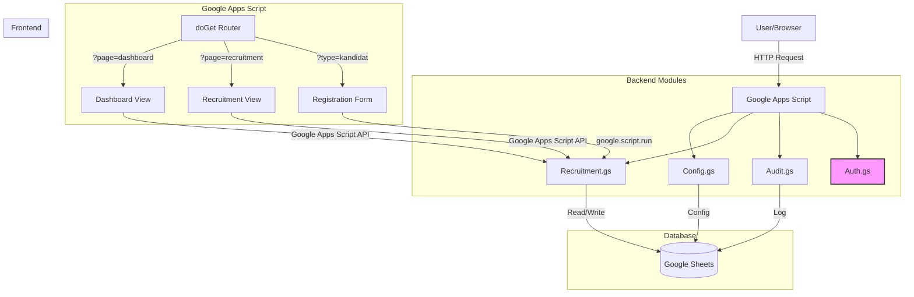

# Mahakarya HRIS — Applicant Tracking System (ATS)

[](https://opensource.org/licenses/MIT)
[](https://script.google.com/)
[](https://getbootstrap.com/)

A comprehensive **Human Resource Information System (HRIS)** with a full-featured **Applicant Tracking System (ATS)** built using **Google Apps Script**, **Google Sheets**, and **Bootstrap 5**.

This system is designed for recruitment management, employee tracking, and HR operations, providing a modern, responsive, and secure web interface directly from Google Workspace.

## 🌟 Features

### Core Modules
- **Recruitment Portal**: Public-facing form for candidates to apply directly
- **Public Registration**: Open application portal for external candidates
- **Recruitment Dashboard**: Comprehensive view of all applicants and their status
- **Employee Management**: Track employee data, contracts, and status
- **Master Data**: Manage organizational data and settings
- **Portal Settings**: Customize portal appearance and behavior

### ATS Features
- **Candidate Pipeline**: Visual representation of the recruitment funnel
- **Contract Tracking**: Monitor contract durations and renewals
- **Dashboard Analytics**: Real-time insights and data visualization
- **Advanced Search**: Full-text search across all candidate fields
- **Smart Filters**: Multi-criteria filtering (status, position, location, salary, etc.)
- **Bulk Actions**: Perform mass updates or deletions on selected candidates
- **Export Options**: Export data to CSV, Excel, and PDF formats
- **Responsive UI**: Seamless experience across desktop, tablet, and mobile devices
- **Dark Mode**: Eye-friendly dark theme for extended use
- **Audit Log**: Complete history of all changes and actions performed

## 🛠️ Tech Stack

| Technology | Usage |
|------------|-------|
| **Google Apps Script** | Backend logic, API, and server-side processing |
| **Google Sheets** | Primary database for all application data |
| **HTML5 / CSS3** | Frontend structure and styling |
| **JavaScript (ES6+)** | Client-side interactivity and logic |
| **Bootstrap 5.3** | Responsive UI framework |
| **Bootstrap Icons** | Icon library |
| **GitHub** | Version control and collaboration |

## 📁 Folder Structure

```plaintext
e:/Project/HRIS/
├── Kode.gs                     # Main entry point & Router (doGet)
├── GenerateDummyData.gs        # Data generation for testing
├── OutsourceForm.html          # Outsource registration form (standalone)
├── FormPendaftaran.html        # Candidate registration form (standalone)
│
├── views/                      # Main HTML templates
│   ├── Dashboard.html          # HR Dashboard (Main interface)
│   ├── DashboardRecruitment.html # Recruitment Dashboard
│   ├── AccessDenied.html       # Access denied page (unauthorized)
│   └── UserManagement.html     # User management (Super Admin only)
│
├── partials/                   # Reusable HTML components
│   ├── Sidebar.html
│   ├── Topbar.html
│   ├── Charts.html
│   ├── Drawer.html
│   ├── Statistics.html
│   ├── CandidateTable.html
│   ├── Modals.html
│   ├── SettingsPanel.html
│   ├── OutsourceTable.html
│   ├── OutsourceFormBody.html
│   ├── FormBody.html
│   └── FloatingActionButton.html
│
├── css/                        # Stylesheets
│   ├── theme.html
│   ├── dashboard.html
│   ├── table.html
│   ├── form.html
│   ├── sidebar.html
│   ├── topbar.html
│   ├── drawer.html
│   ├── modal.html
│   ├── responsive.html
│   └── table.html
│
├── js/                         # Client-side JavaScript
│   ├── app.html                # Main application logic
│   ├── api.html                # API communication layer
│   ├── charts.html             # Data visualization
│   ├── dashboard.html          # Dashboard specific logic
│   ├── filters.html            # Advanced filtering system
│   ├── table.html              # Table interactions
│   ├── export.html             # Data export functionality
│   ├── import.html             # Data import functionality
│   ├── settings.html           # Settings management
│   ├── helpers.html            # Utility functions
│   ├── regions.html            # Region/Address data handling
│   ├── drawer.html             # Side drawer logic
│   ├── formApp.html            # Form submission logic
│   ├── modals.html             # Modal dialogs
│   ├── outsourceApp.html       # Outsource module logic
│   └── outsourceDashboard.html # Outsource dashboard logic
│
├── backend/                    # Server-side Google Apps Script modules
│   ├── Config.gs               # Global constants and configuration
│   ├── Utilities.gs            # Helper functions (findCandidateRow_, etc)
│   ├── Sheets.gs               # Spreadsheet management
│   ├── Validation.gs           # Server-side form validation
│   ├── Audit.gs                # Audit logging
│   ├── Recruitment.gs          # CRUD operations for candidates
│   ├── BulkActions.gs          # Bulk update & delete
│   ├── IdGenerator.gs          # ID generation for recruitment & employees
│   ├── Export.gs               # Server-side export logic
│   ├── Import.gs               # CSV/Excel import logic
│   ├── Settings.gs             # Application settings
│   ├── PortalSettings.gs       # Portal configuration
│   ├── Outsource.gs            # Outsource employee management
│   └── Auth.gs                 # Authentication & authorization
│
└── data/                       # Static data files
    ├── master_wilayah.json     # Master region data
    └── kecamatan_all.json      # District data
```

## 📸 Screenshots

> *Note: Screenshots will be added here.*

### Dashboard


### Recruitment


### Registration Form


## 🚀 Installation

### Prerequisites
- A Google Account with access to Google Drive
- Basic knowledge of Google Apps Script

### Steps

1. **Clone the Repository**
   ```bash
   git clone https://github.com/your-username/HRIS.git
   cd HRIS
   ```

2. **Open Google Apps Script**
   - Go to [script.google.com](https://script.google.com/)
   - Click **New Project**
   - Click **File** > **Project Properties** > Get the **Script ID**

3. **Copy Files**
   - Create new files in the Apps Script editor matching the folder structure above
   - Copy the content of each file into the corresponding Apps Script file
   - **Important**: Place all `.gs` files in the root or ensure they are properly included

4. **Configure Spreadsheet**
   - Create a new Google Spreadsheet
   - Copy the Spreadsheet ID from the URL
   - Update `backend/Config.gs` if you need custom sheet names (defaults are set)

5. **Deploy as Web App**
   - Click **Deploy** > **New Deployment**
   - Select type: **Web app**
   - Execute as: **Me**
   - Who has access: **Anyone** (for public forms) or **Anyone within [your org]** (for internal dashboards)
   - Click **Deploy**
   - Copy the Web App URL

6. **Initial Setup**
   - Access the Web App URL
   - The system will automatically create necessary sheets in your spreadsheet

## 🏗️ Project Architecture



**Flow:**
1. **User** accesses the web app URL via browser
2. **Router** (`doGet` in `Kode.gs`) determines which page to serve based on URL parameters
3. **Views** (HTML templates) are rendered with embedded CSS and JS
4. **Frontend JS** communicates with **Backend Modules** via `google.script.run`
5. **Backend Modules** interact with **Google Sheets** for data persistence
6. **Audit Log** tracks all modifications for compliance and history

## 🗺️ Roadmap

### ✅ Completed
- [x] Core Recruitment Module (CRUD)
- [x] Public Candidate Registration Form
- [x] HR Dashboard with Analytics
- [x] Employee Management (Basic)
- [x] Recruitment Pipeline Visualization
- [x] Advanced Filtering & Search
- [x] Bulk Actions (Update/Delete)
- [x] Data Export (CSV, Excel, PDF)
- [x] Data Import (CSV)
- [x] Dark Mode Support
- [x] Mobile Responsive UI
- [x] Audit Logging System
- [x] Portal Settings & Configuration

### 🚧 In Progress
- [ ] Google SSO Authentication — using Google's built-in session (no OAuth library needed)

### ✅ Completed (Recent)
- [x] Role-Based Access Control (RBAC) — 5 roles: Super Admin, HR Admin, Recruiter, Manager, Viewer
- [x] User Management Module — CRUD users, role assignment (Super Admin only)
- [x] Authorization Guards — Server-side permission checks + client-side auth flow

### 🔮 Planned
- [ ] Attendance Management
- [ ] Leave Management System
- [ ] Payroll Integration
- [ ] Performance Review Module
- [ ] Asset Management
- [ ] Training & Development Tracker
- [ ] Advanced Reporting & BI
- [ ] Email Notification System
- [ ] API Integrations (LinkedIn, JobStreet, etc.)

## 📄 License

This project is licensed under the **MIT License** - see the [LICENSE](LICENSE) file for details.

## 👨‍💻 Author

**Muhammad Sultotni Powered by NOTO**
- GitHub: (https://github.com/Sultonisky)
- Email: (muhsultonipml111@gmail.com)

---

*Built with ❤️ using Google Apps Script and Bootstrap 5*
